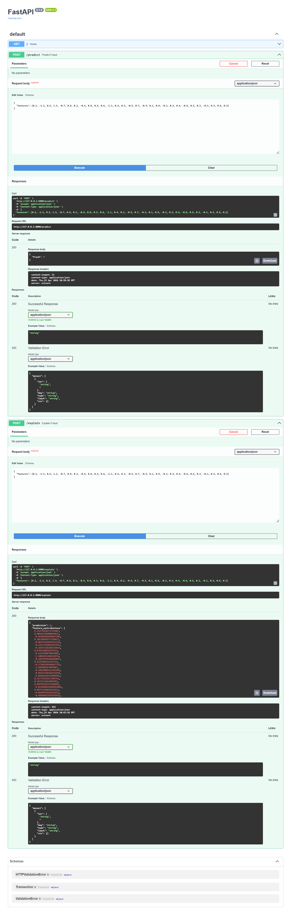
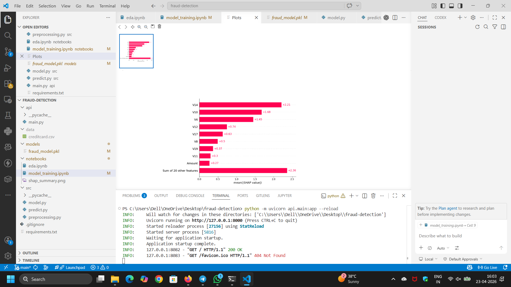

# 🚀 Fraud Detection System with Explainable AI

## 📌 Overview

This project builds an end-to-end fraud detection system using machine learning on highly imbalanced financial transaction data. It not only predicts fraudulent transactions but also explains the reasoning behind predictions using Explainable AI (SHAP).

The system is designed to simulate a real-world production setup with API integration for real-time usage.

---

## 🎯 Problem Statement

Fraud detection is challenging due to:

* Highly imbalanced datasets (fraud cases are very rare)
* Evolving fraud patterns
* Need for high recall to avoid missing fraud cases

This project addresses these challenges using machine learning and explainable AI techniques.

---

## ⚙️ Tech Stack

### 🧠 Data Science & Machine Learning

* Python
* Pandas, NumPy
* Scikit-learn
* XGBoost

### 📊 Visualization & Explainability

* Matplotlib, Seaborn
* SHAP (Explainable AI)

### 🌐 Backend

* FastAPI

### 🛠️ Tools

* Git, GitHub
* Jupyter Notebook

---

## 🔍 Key Features

* Handles **imbalanced dataset** using resampling techniques
* Fraud detection using **XGBoost model**
* Model evaluation using **Precision, Recall, F1-score**
* Explainable AI using **SHAP**
* REST API for **real-time prediction**
* Scalable backend architecture

---

## 🏗️ Project Structure

fraud-detection/
│── data/ (ignored)
│── notebooks/
│── api/
│── models/
│── images/
│── README.md

---

## 📂 Dataset

Dataset used:
👉 https://www.kaggle.com/datasets/mlg-ulb/creditcardfraud

### 📥 How to use

1. Download dataset from Kaggle
2. Place it inside:
   data/creditcard.csv

---

## ▶️ How to Run the Project

### 🔹 Step 1: Install dependencies

```bash
python -m pip install pandas numpy scikit-learn matplotlib seaborn fastapi uvicorn shap xgboost
```

### 🔹 Step 2: Run API

```bash
python -m uvicorn api.main:app --reload
```

### 🔹 Step 3: Open in browser

http://127.0.0.1:8000/docs

---

## 🌐 API Endpoints

### 🔹 Predict Fraud

POST /predict

#### Input:

```json
{
  "features": [29 values]
}
```

#### Output:

```json
{
  "fraud": 1
}
```

---

### 🔹 Explain Prediction

POST /explain

#### Output:

```json
{
  "prediction": 1,
  "feature_contributions": [values...]
}
```

---

## 📊 Model Details

* Algorithm: XGBoost Classifier
* Handles imbalance using:

  * Downsampling / SMOTE
* Evaluation Metrics:

  * Precision
  * Recall ⭐
  * F1-score

---

## 🧠 Explainable AI

This project uses SHAP to:

* Interpret model predictions
* Identify feature importance
* Improve model transparency

---

## 📸 Screenshots

### 🔹 API Interface



### 🔹 SHAP Output



---

## 🚀 Future Improvements

* Add frontend dashboard (React)
* Deploy on cloud (AWS / Render)
* Improve model performance

---

## 💡 Key Learnings

* Handling imbalanced datasets
* Building end-to-end ML systems
* Explainable AI integration
* API development using FastAPI

---

## 👩‍💻 Author

Chilaka Naga Vaishnavi
GitHub: https://github.com/Vaishu0805

---

## ⭐ If you like this project

Give it a ⭐ on GitHub!
